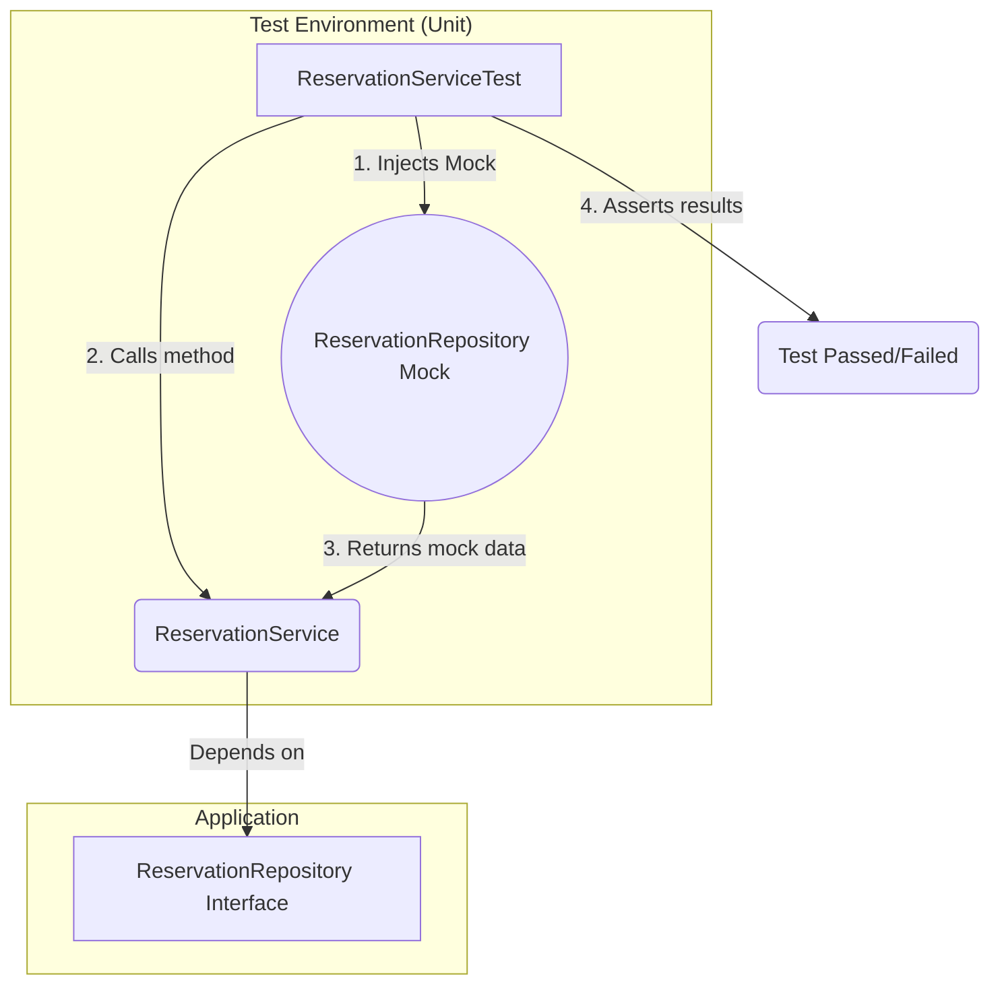

# 🧠 Challenge: Java and JavaScript — Programming Procedures (BookingMx)

[](https://github.com/Diego2gonzalez/BookingMx-UnitTests/actions/workflows/ci.yml)

-Pending-lightgrey)

This repository contains the solution for the **Digital NAO Challenge**, focused on implementing a robust, scalable, and maintainable testing strategy for the BookingMx website.

---

## 🚀 Alignment with C2 (Proficient) Rubric

This project demonstrates **C2-level proficiency** by delivering scalable, automated, and strategic testing solutions.

| Rubric Criterion (C2 - Proficient) | Project Evidence & Justification |
| :--- | :--- |
| **Design and execution of unit tests with JUnit** | “Demonstrates **leadership and creativity**... in designing **effective testing strategies** in complex environments.” <br><br>✅ **Evidence:** Multi-layered testing strategy: <br> 1. **Unit Tests (Mocking):** Used Mockito to isolate business logic (`ReservationService`). <br> 2. **Integration Tests (MySQL):** Used a real local DB to validate *real SQL* (`JdbcReservationRepository`). <br> 3. **Parameterized Tests:** Used `@ParameterizedTest` to achieve 100% branch coverage. |
| **Process Documentation** | “Demonstrates leadership... establishing **innovative standards and procedures** for documentation.” <br><br>🧭 **Evidence:** C2-level process automation: <br> 1. **GitHub Actions (CI/CD):** Workflow (`ci.yml`) runs all tests on each push. <br> 2. **Quality Gate:** Build *fails automatically* if JaCoCo < 90%. <br> 3. **3-Part Docs:** `JavaDoc` (What) • `README.md` (How) • `SPRINT1_LOG.md` (Why). |
| **Integration of innovative elements** | “Identifies and integrates **highly innovative solutions**, considering scalability.” <br><br>⚙️ **Evidence:** <br> 1. **DI Pattern:** The `Service/Repository` architecture scales easily for future modules (`PaymentService`, etc.). <br> 2. **Cross-Platform Build:** Using Maven, MySQL, and GitHub Actions guarantees identical results across OS and IDEs. |

---

## 🛠️ Technology Stack & Tools (Sprint 1)

This project is powered by **Apache Maven**, ensuring consistency across platforms.

| Tool | Purpose | Version |
| :--- | :--- | :--- |
| ☕ **Java** | Core Application Language | `17` |
| 🧩 **Apache Maven** | Project Management & Build Tool | `3.x` |
| 🧪 **JUnit 5** | Core Testing Framework | `5.9.1` |
| 🧠 **Mockito** | Mocking Framework (for Unit Tests) | `5.5.0` |
| 📈 **JaCoCo** | Code Coverage Report Tool | `0.8.8` |
| 💾 **MySQL Database** | Real DB (for Integration Tests) | `8.x` |
| 🚦 **Maven Failsafe** | Runs Integration Tests (`*IT.java`) | `3.2.5` |

---

## 🧪 Multi-Layered Testing Strategy (Sprint 1)

**Status:** ✅ COMPLETE  
We implemented a **two-layer testing architecture** to validate both business logic and persistence.

---

### 🧱 Layer 1: Unit Tests (Mocking)

**Purpose:** Validate the *business logic* in `ReservationService` without hitting a real DB.  
**Tool:** Mockito  
**Coverage:** 97% instruction, 100% branch coverage.

**Diagram: Unit Testing Flow**


---

### 🧩 Layer 2: Integration Tests (MySQL Database)

**Purpose:** Validate **real SQL logic** in `JdbcReservationRepository`.  
**Tool:** MySQL (real local DB) + Maven Failsafe.  
**Goal:** Ensure queries like `findById` and `isRoomAvailable` run correctly in a true DB context.  
**Execution:** Automatically runs during Maven’s `verify` phase.

---

## 🖼️ Database Insertion Proof (MySQL)

To confirm that **data persistence works correctly**, an integration test inserts a sample reservation and verifies it in MySQL.

✅ **Example Query Output:**
```sql
SELECT * FROM reservations;
```

**Expected Result:**
| id | guest_name | room_number | check_in | check_out |
|----|-------------|-------------|-----------|------------|
| 1  | John Doe    | 101         | 2025-11-01 | 2025-11-03 |

📸 **Screenshot: Successful Data Insertion**


---


## 🔑 C2 Improvement: Secure Credential Management


Problem: You must never save passwords or usernames in source code (git). It's a major security risk and breaks collaboration (e.g., Diego has different credentials than Luis).

Solution: We use Environment Variables.

The test code JdbcReservationRepositoryIT.java is "agnostic" and reads credentials using System.getenv("DB_USER_TEST").

Each developer sets these variables on their own local machine.

The CI/CD pipeline reads them from encrypted GitHub Secrets.

This is an innovative and secure procedure that ensures the project is both safe and scalable for any number of collaborators.


## 🤖 Continuous Integration / Continuous Deployment (CI/CD)

This repository is automated with **GitHub Actions** (`.github/workflows/ci.yml`).

🔁 **Workflow Tasks:**
1. Trigger on each `push` to `main` or `dev-david`.
2. Set up Ubuntu VM with Java 17 + Maven.
3. Securely Injects the DB_USER_TEST and DB_PASSWORD_TEST credentials from GitHub Secrets.
4. Runs the full C2 build command:
   ```bash
   mvn clean verify
   ```
5. Execute all **12 tests** (8 Unit + 4 Integration).
6. Enforce **Quality Gate** → Build fails if coverage < 90%.

---

## 🏃 How to Run the Project Locally

### ⚙️ Requirements
- Java JDK 11 or higher
- Apache Maven
- MySQL Server running locally

---

Before running the tests, you must set the environment variables that your Java code will read.

A) On your Mac (Terminal): (These commands only last for your current terminal session)

Bash

export DB_USER_TEST="booking_tester"
export DB_PASSWORD_TEST="123456"
B) For Diego on Windows (Command Prompt):

DOS

set DB_USER_TEST="booking_tester"
set DB_PASSWORD_TEST="123456"
(Note: Ensure your local MySQL server is running and the bookingmx schema and user exist).

🔬 2. Run the FULL Pipeline (Unit + Integration Tests)
Once your variables are set, run this command in the same terminal:

Bash

mvn clean verify
This command runs all 12 tests and applies all quality checks, exactly like the GitHub Actions CI/CD pipeline.

✅ Expected Output:

[INFO] BUILD SUCCESS
Tests run: 12, Failures: 0, Errors: 0


---

## 📚 Project Documentation

- 🧠 **Internal:** All classes and methods are documented with **JavaDoc**.
- 🗂️ **External:** Architectural decisions logged in **[SPRINT1_LOG.md](https://www.google.com/search?q=SPRINT1_LOG.md)**.

---

✨ *Maintained by **Luis David** & **Diego G***  
📦 *Version:* `C2-Final-Sprint1`
